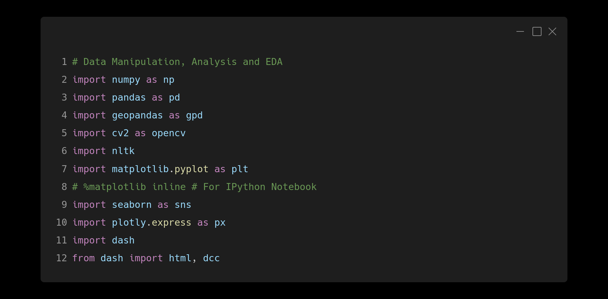
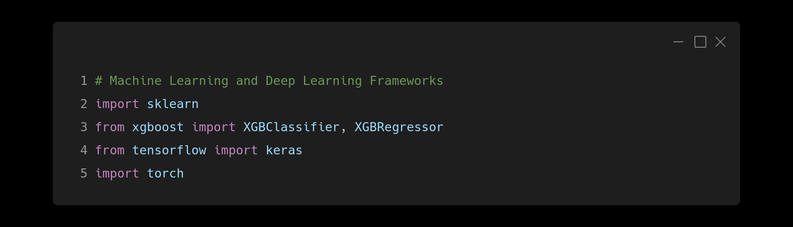
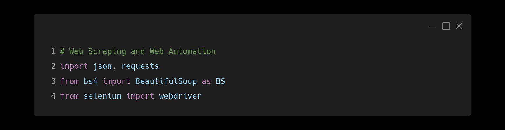
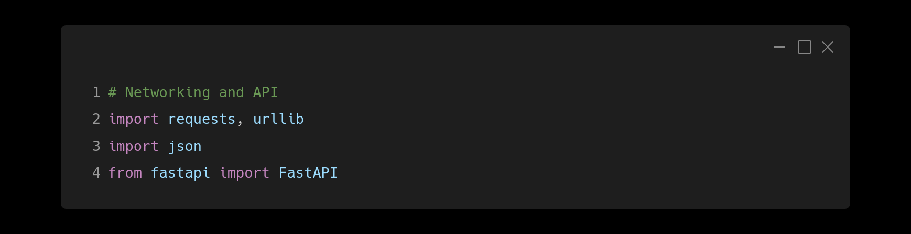
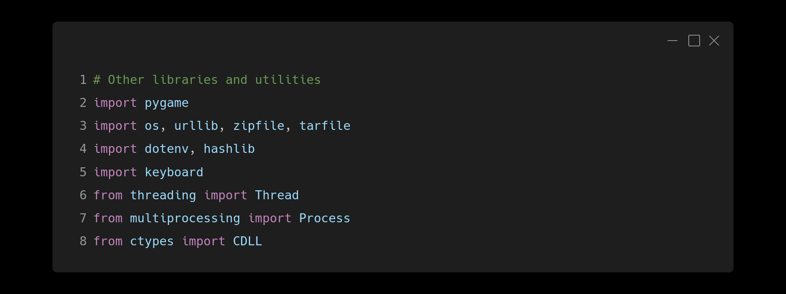

# Introduction!
## Full Name: Sarzil Hossain [(My Portfolio)](https://prmethus.github.io/)

### Identity: A 16 year old Student, Programmer, AI and Data Science enthusiast from Bangladesh!

 

 

# My Skills!

 

### Programming Languages, Frameworks and Game Engines

 

### Database Management Systems

 

### Other Tools

 

### Data Manipulation

### Machine Learning and Deep Learning Frameworks

### Web Scraping and Web Automation

### Networking and API

### Other Libraries and Utilities

